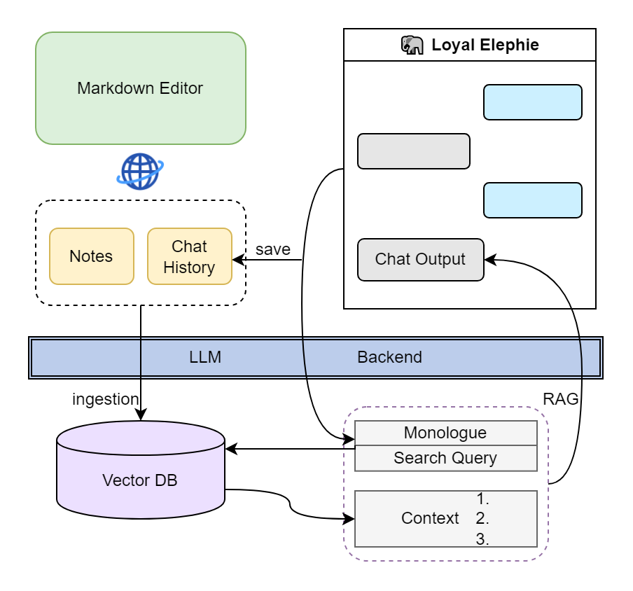
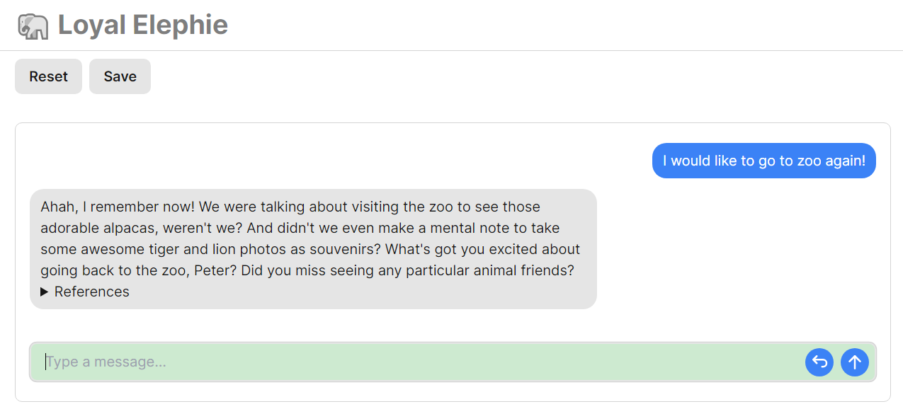
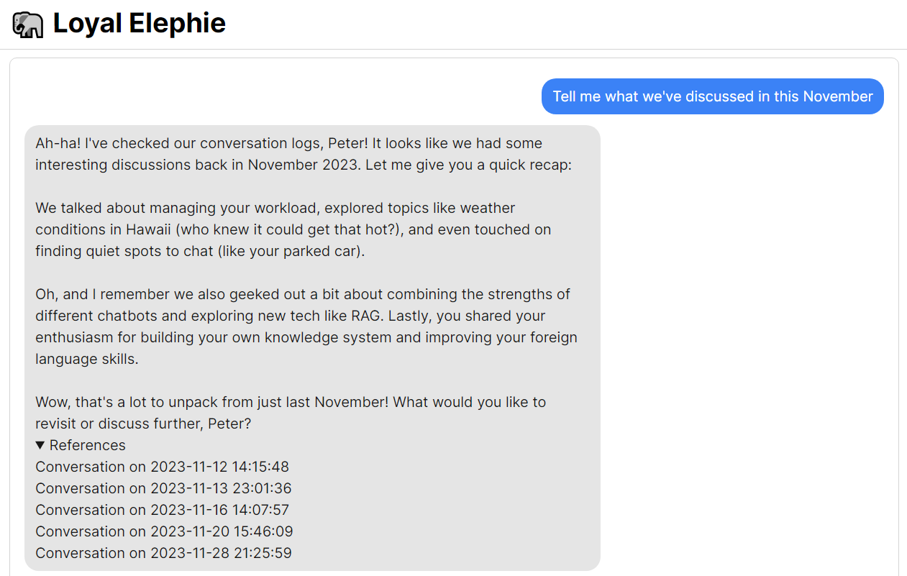
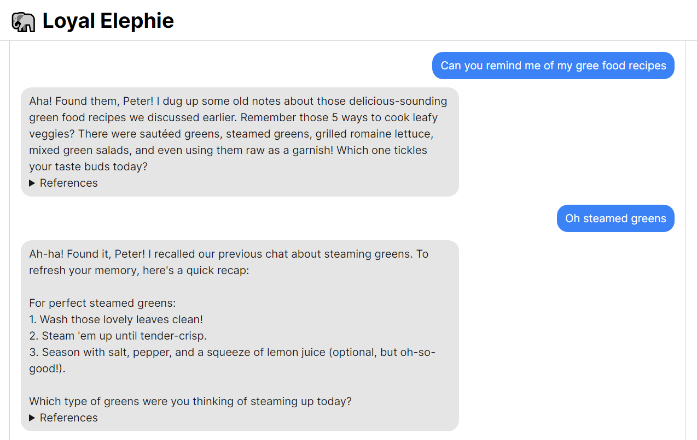

# Loyal Elephie: Your Trusty Memory-enabled AI Companion 🧠

 Embark on an exciting adventure with Loyal Elephie, your faithful AI sidekick! This project combines the power of a neat Next.js web UI and a mighty Python backend, leveraging the latest advancements in Large Language Models (LLMs) and Retrieval Augmented Generation (RAG) to deliver a seamless and meaningful chatting experience!

## Features

1. **Controllable Memory:** Take control of Loyal Elephie's memory! You decide which moments to save, and you can easily edit the context as needed. It is your second-brain for episodic memory. 

2. **Hybrid Search:** Experience the powerful combination of ChromaDB and BM25 for efficient searches! It's also optimized for handling date-relevant queries. 

3. **Secure Web Access:** With a built-in login feature, only authorized users can access your AI companion, ensuring your conversations remain private and secure over the internet. 

4. **Streamlined LLM Agent:** Loyal Elephie uses XML syntax with no function-calling required. It is also optimized for less token usage and works smoothly with great local LLMs using Llama.cpp or ExllamaV2. 

5. **(Optional) Markdown Editor Integration:** Connect with online Markdown editors to view the original referred document during chats and experience real-time LLM knowledge integration after editing your notes online. 

Loyal Elephie supports both open and proprietary LLMs and embeddings serving as OpenAI compatible APIs. 




## Screenshots 
*Meta-Llama-3-70B-Instruct.Q4_K_S.gguf was used when capturing the below screenshots*








## Deployment

**1. Clone Repo**

```bash
git clone https://github.com/davidlang422/Loyal-Elephie.git
```

**2. Install Frontend Requirments**

```bash
cd frontend
npm i
```

**3. Configure Login Users**

frontend/users.json
```json
[{
    "username":"admin",
    "password":"admin"
}]
```

**4. Install Backend Requirements**

```bash
cd backend
pip install -r requirements.txt
```

**5. Configure Backend Settings**

```python
# backend/settings.py
NICK_NAME = 'Peter' # This is your nick name. Make sure to set it at the beginning and don't change so that LLM will not get confused.

CHAT_BASE_URL = 'https://api.openai.com/v1' # Modify to your OpenAI compatible API url
CHAT_API_KEY = 'your-api-key'
CHAT_MODEL_NAME = "gpt-3.5-turbo"

# Language Preference (experimental)
# Supported Languages: English, Chinese, German, French, Spanish, Portuguese, Italian, Dutch, Czech, Polish, Russian, Arabic
LANGUAGE_PREFERENCE = "English"
```

**6. Run App**

frontend:
```bash
cd frontend
npm run build
npm run start
```
backend:
```bash
cd backend
python app.py
```

# Usage Tips
* By default, visit Loyal Elephie from http://localhost:8080
* use "Save" button to save the current conversation into Loyal Elephie's memory
* use "Reset" button to clear the current conversation (not affecting saving status, the same as refreshing page)
* click on the titles in "Reference" to navigate to the corresponding Markdown notes (but SilverBulletMd or another web Markdown editor has to be hosted and configured)

Some of the workable local LLMs tested:
* OpenHermes-2.5-Mistral-7B
* Mixtral-8x7B-Instruct-v0.1
* c4ai-command-r-v01
* Meta-Llama-3-70B-Instruct (Best so far)
* Qwen2-72b-instruct (Best for non-English languages)

For those who need hand-on local embedding API, an embedding server example is added to "external_example". You will need to install "sentence_transformers" to run it. After deployment, modify "settings.py" to finish configuration:

```python
EMBEDDING_BASE_URL = 'http://localhost:8001/v1' # local embedding deployment URL
```
